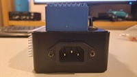
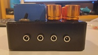
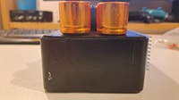
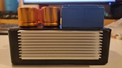
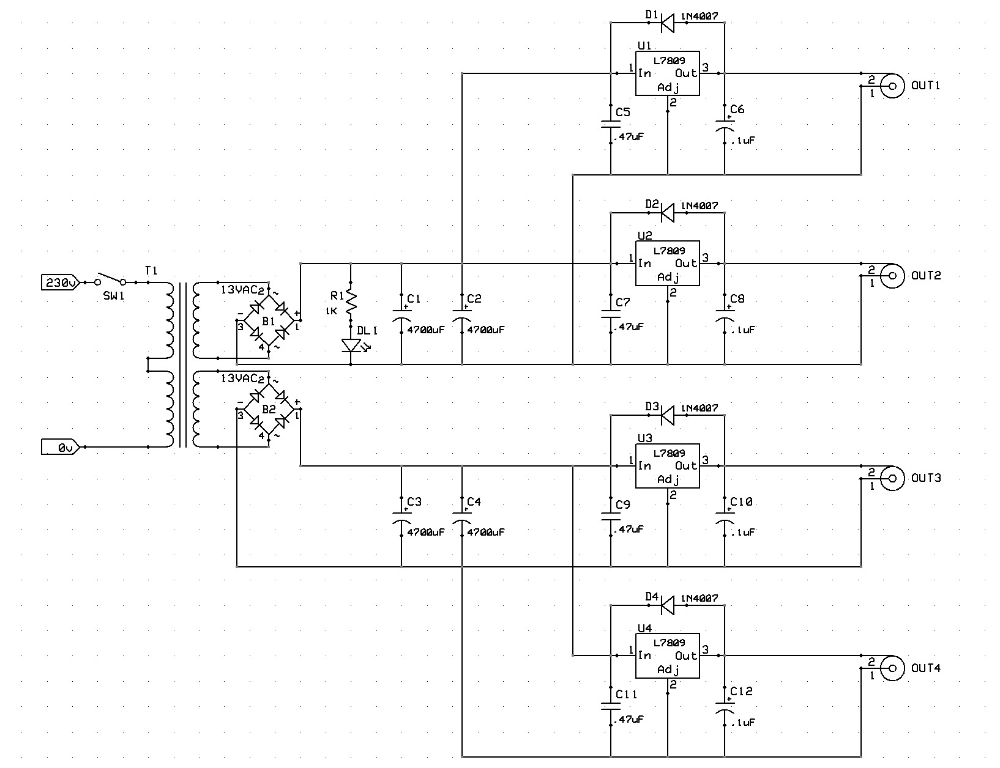
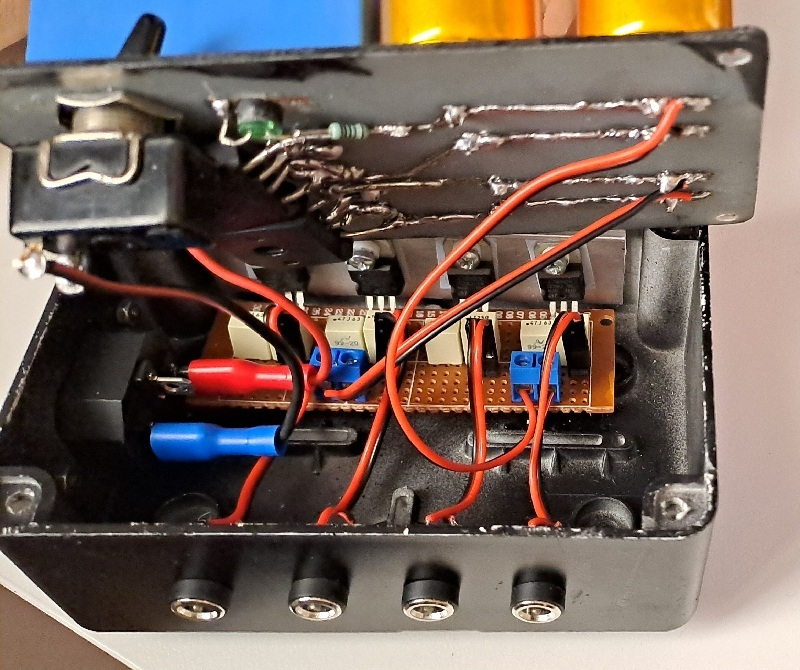
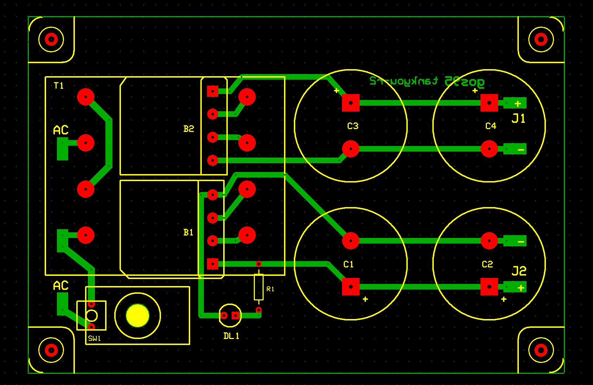
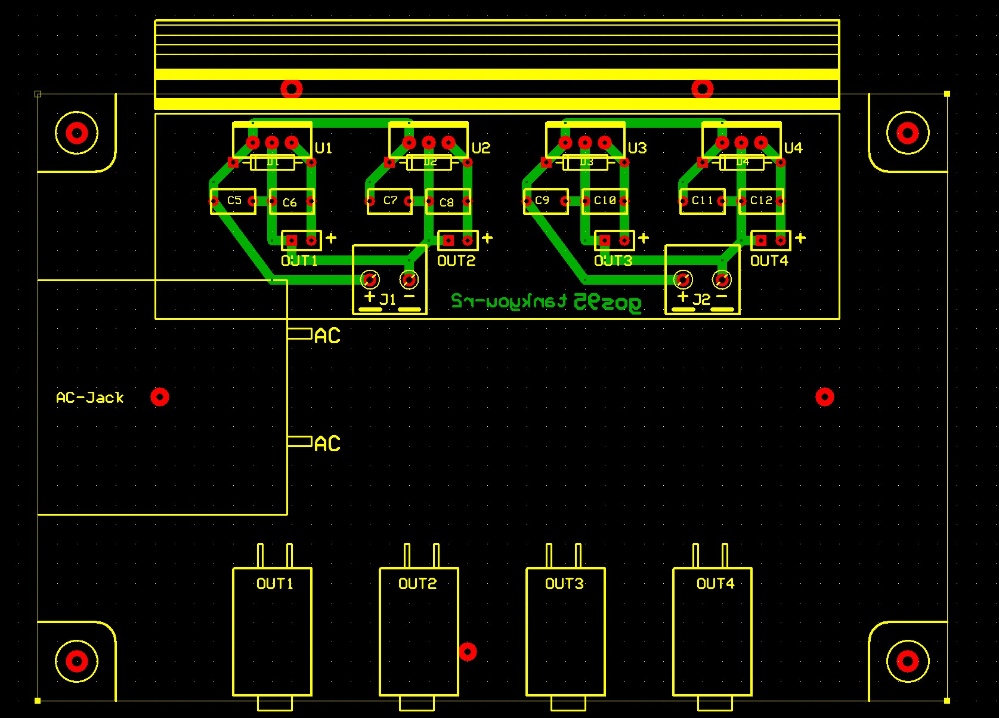

# TankYou rev2
A simple 4-line linear power supply bank (9V DC) connected to the mains. 

> [!CAUTION]
> **SAFETY WARNING**: This project involves working with **mains voltage (230V AC)**. Lethal voltages are present in the circuit. Do not attempt to build or test this device unless you are experienced in handling high-voltage electronics. Always ensure the device is unplugged before touching any internal component and that the primary section is properly insulated.

## Specifications
- Power source from mains
- 2 galvanically isolated ground domains
- 4 Regulated 9V DC Lines (2 per isolated ground)
- 200mA max per line (Center-Negative polarity)
- Heavy-duty PVC enclosure (from an electrical junction box)
- An old-fashioned external look

## Design
The design intentionally prioritizes simplicity, availability of common components, and practical reliability over maximum electrical performance... Moreover the exposed aesthetic identity of the encapsulated transformer and the 4 giant and so beautiful caps.

### Schematic

### Circuit Analysis
The circuit is organized in three stages: transformer and rectification, filtering, and voltage regulation.

**Transformer and rectification:** 
*Notes: The transformer is rated at 9 VAC nominal, but the unloaded secondary voltage measures approximately 13 VAC, which is typical for small EI transformers.*

The mains transformer provides two independent secondary windings to achieve galvanic isolation between the two ground domains.
Each winding is rectified independently by bridge rectifiers, producing the following $DC$ voltage before filtering:

$V_{DC} = V_{AC} \times \sqrt{2} - 2 \times V_D$

Assuming $V_D=0.7V$ and a measured secondary voltage of $13 VAC$:

$V_{DC}​​ = 13 \times \sqrt{2}​ - 1.4 \approx 16.9V$

**Filtering:** 
Each rectified rail is filtered by bulk electrolytic capacitors ($C = 4700\mu F$). 
The ripple voltage under maximum load is calculated as:

$V_{ripple} = \frac{I_{load}}{2 \times f \times C}$

At maximum combined load for each isolated domain ($I_{load} = 400mA$ total per domain, $f=50Hz$):

$V_{ripple} = \frac{0.4}{2 \times 50 \times 4700 \times 10^{-6}} \approx 0.85V_{pp}$

**Voltage Regulation:** 
Four standard $7809$ linear regulators produce the four regulated $9V$ output rails. Under an actual full rated load of $200mA$ per line, the transformer exhibits a typical voltage regulation drop, settling the regulator input voltage ($V_{IN}$) at $\approx 13.3V \div 13.5V$ (as documented in the Test Log). This dynamic adjustment yields a real static headroom of:

$V_{headroom} = V_{IN} - V_{out} = 13.3V - 9.1V \approx 4.2V$

which is safely above the $7809$ internal dropout voltage ($\approx 2.0V$) and the calculated ripple, ensuring stable regulation.

**Power dissipation:** 
Using the real-world measured $V_{IN} \approx 13.3V$ under the maximum nominal current ($200mA$):

$P_{U_{MAX}} = (V_{IN} - V_{out}) \times I_{MAX} = (13.3 - 9.1) \times 0.2 = 0.84W$

The $78xx$ regulators in TO-220 package have a thermal resistance $\Theta_{jc} = 5 K/W$. All four regulators are mounted on a shared aluminum heatsink with an estimated thermal resistance ($\Theta_{hs}$) between $5K/W$ and $7K/W$. With $T_A = 30^\circ C$ and $\Theta_{cs} \approx 1$:

$T_{hs} = T_A + 4 \times P_{U_{MAX}} \times \Theta_{hs} = 30 + 3.36 \times 7 \approx 55^\circ C$ 
$T_j = T_{hs} + P_{U_{MAX}} \times (\Theta_{jc} + \Theta_{cs}) \approx 55 + 5 \approx 60^\circ C$

Junction temperature remains well within the absolute maximum rating ($125^\circ C$).

**Protection:** 
Each regulator is protected by an antiparallel diode connected between OUT and IN. This safeguards the regulation stage against reverse currents from inductive or capacitive loads during power-down cycles.

## Implementation and Test

### PCB Layout
The circuit was designed with ExpressPCB.

> [!NOTE]
> The circuit is housed in a standard PVC electrical junction box. Because the enclosure is fully made of insulating plastic material, a chassis earth connection is not strictly required for external user safety. However, inside the box, all AC mains paths are kept physically separated from the low-voltage DC sections.

### Calibration Procedure
No calibration required. Output voltages are determined by the fixed internal reference of the $7809$.

### Test Log
#### Load and Dropout Test
**Line 1**:
| Load (mA) | $V_{OUT}$ (V)  | $V_{IN} regulator$ (V) |
|:---:|:---:|:---|
|0|9.2|16.8|
|50|9.1|15.9|
|100|9.1|15.7|
|150|9.1|15.3|
|200|9.1|13.3|
|500|8.9|10.8|

**Line 2**:
| Load (mA) | $V_{OUT}$ (V)  | $V_{IN} regulator$ (V) |
|:---:|:---:|:---|
|0|9.1|16.8|
|50|9.1|15.9|
|100|9.1|15.7|
|150|9.0|14.0|
|200|9.0|13.3|
|500|8.8|10.8|

**Line 3**:
| Load (mA) | $V_{OUT}$ (V)  | $V_{IN} regulator$ (V) |
|:---:|:---:|:---|
|0|9.2|16.7|
|50|9.2|15.6|
|100|9.0|14.6|
|150|9.0|14.1|
|200|9.0|13.5|
|500|8.9|10.9|

**Line 4**:
| Load (mA) | $V_{OUT}$ (V)  | $V_{IN} regulator$ (V) |
|:---:|:---:|:---|
|0|9.2|16.7|
|50|9.2|15.6|
|100|9.2|14.6|
|150|9.1|14.1|
|200|9.1|13.5|
|500|9.0|10.9|

#### Thermal Dissipation Test
Due to test bench limitations (availability of two dummy loads: one [resistive dummy load](https://github.com/gom9000/xp-dummyload/tree/master/dummyload-resistor-9) and one [MOSFET active dummy load](https://github.com/gom9000/xp-dummyload/tree/master/dummyload-mosfet)), the test was conducted by drawing a continuous maximum load of $200mA$ simultaneously on 2 lines (one per isolated domain: Line 1 and Line 4) for a duration of 60 minutes, at a stable ambient temperature ($T_{amb} = 30^\circ C$):

| Elapsed (minutes) | $T_{hs} (^\circ C)$ |
|:---:|:---|
|0|30|
|15|37|
|30|39|
|45|40|
|60|40|

- **Domain 1, Line 1**: $V_{IN} \approx 13.3V$, dropping $13.3V - 9.1V = 4.2V$ across regulator U1. Power dissipation: $P = 4.2V \times 0.2A = 0.84W$.
- **Domain 2, Line 4**: $V_{IN} \approx 13.5V$, dropping $13.5V - 9.1V = 4.4V$ across regulator U4. Power dissipation: $P = 4.4V \times 0.2A = 0.88W$.

Total power dissipation delivered to the shared heatsink:

$P_{tot} = 0.84 + 0.88 = 1.72W$

Using the thermal Ohm's law, the actual thermal resistance of the external heatsink ($\Theta_{hs}$) is experimentally derived as:

$\Theta_{hs} = \frac{\Delta T}{P_{tot}} = \frac{T_{hs} - T_{amb}}{P_{tot}} = \frac{40^\circ C - 30^\circ C}{1.72W} \approx 5.8 \, K/W$

#### Output Noise and Ripple Test
The output AC ripple and noise were monitored under a full $200mA$ resistive load using an FNIRSI 1014D digital oscilloscope (AC coupling). The output waveform shows no periodic $100 \, Hz$ ripple component above the instrument's noise floor (~50mV/div minimum scale).

Testing the supply output connected in series with a $1\mu F$ polyester capacitor directly into a high-gain guitar amplifier at maximum volume, reveals only broadband thermal noise with no tonal AC components, confirms the absence of audible hum or buzz.

## Conclusions
**Results**: The unit ensures good regulation within the full nominal operating scale ($0 \div 200mA$), which is within standard audio/pedalboard requirements.

**Suggestions**: Add a slow-blow fuse on the transformer primary side to improve safety against internal shorts.

## About & License
**Author**: Alessandro Fraschetti (gom9000). 
**Technical Notes**: The hardware design was supported by **ExpressPCB** and the custom **[expresspcb-goslib](https://github.com/gom9000/expresspcb-goslib)** libraries. 
**License**: This project is licensed under the [MIT License](LICENSE).
