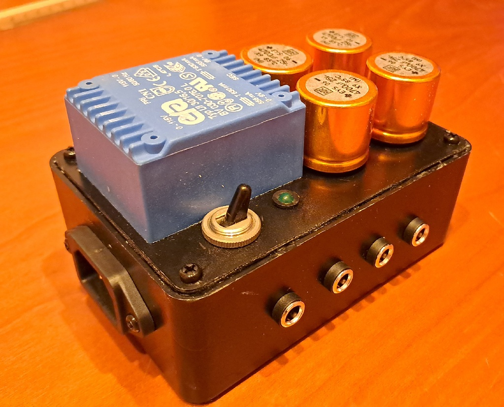
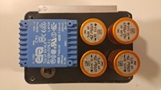

# TankYou rev2
A simple 4-lines power supply (9 volt) bank connected to the mains. 
This is a simple project for a 4-lines power supply bank capable of powering small household devices.

## Specifications

### Features
- power source from mains
- 2 isolated grounds
- 2 separated and regulated 9V-200mA output lines (center-negative) on each ground

### Hardware
Schematics and PCB layouts are designed with ExpressPCB free CAD software.

#### Schematic:

#### PCB Layout:

## About
Author : Alessandro Fraschetti (mail: [gos95@gommagomma.net](mailto:gos95@gommagomma.net))

## Licence
This project is under the [MIT license](LICENSE).
You are free to use this for any purpose, just try to give credit in the documentation of your project.
